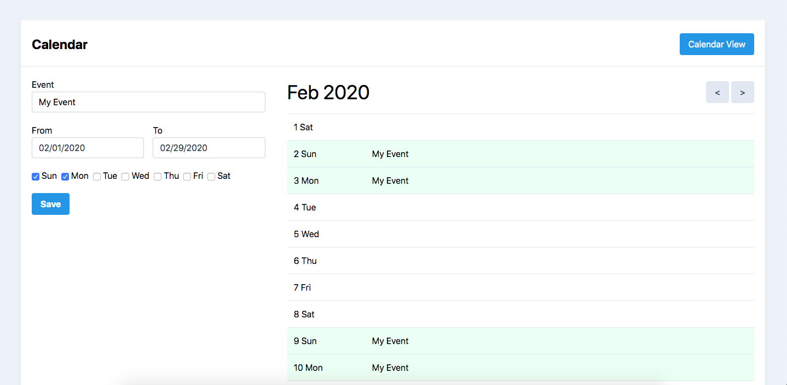

# Events Calendar App



## Setup

### With Docker

Requirements: npm, Docker

```
cd path/to/exam/src

# Setup env
cp .env.example .env

# Install dependencies
docker run --rm -v "$(pwd)":/app composer install
npm install

# Run containers
docker-compose build && docker-compose up -d

# Setup Laravel
docker-compose exec php php /var/www/artisan key:generate
docker-compose exec php php /var/www/artisan cache:clear
docker-compose exec php php /var/www/artisan migrate

# Build js
npm run dev
```

This will run the app at port 8080 and mysql at 3306.

Open http://localhost:8080 to run the app.

### Without Docker

Requirements: composer, npm/yarn

```
cd path/to/exam/src
cp .env.example .env # setup env
composer install
npm install

php artisan key:generate
php artisan cache:clear
php artisan migrate

npm run watch
php artisan serve
```